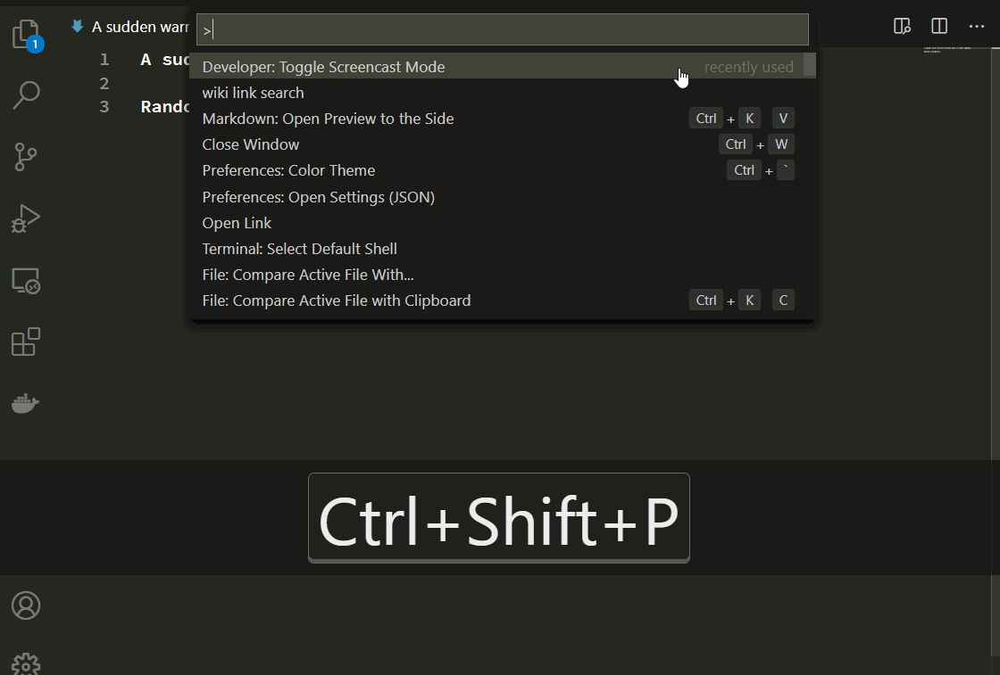

# wiki link

People who writing technical or maybe non technical article with markdown, sometimes want to refer to wiki for some terminology, this tool can help to do that with easy command.

## Features

Usage is simple:
1. Select the word you want to replace with Wiki Link
2. `Ctrl+Shift+P` get command prompt
3. Select the most relevant link
4. If no result, can type new key word to search again




## Configuration

Can add following to the setting file:

- How many links maxium you want to list when search

  ```json
  {
    "wikilink.linknum": 5 
  }
  ```

Or go to settings page and find `extentions > WikiLink`.
